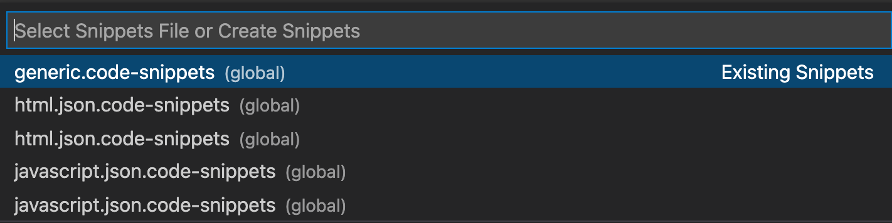
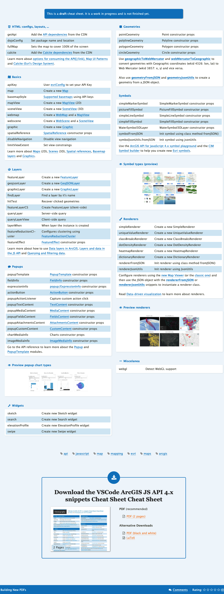

# esri-vscode-snippets

Here I share the **Global** [User Snippets](https://code.visualstudio.com/docs/editor/userdefinedsnippets) I have in my local folder: `~/Library/Applications Support/Code/User/snippets`. Just in case you want to reuse any of them.

I use customize the [ArcGIS API for JavaScript Snippets - Visual Studio Extension](https://github.com/Esri/arcgis-js-vscode-snippets/tree/master/snippets). It also allows me to test them before contributing.

Here you can see a [cheatsheet I have created](https://cheatography.com/hhkaos/cheat-sheets/vscode-arcgis-js-api-4-x-snippets-cheat-sheet/) (it is \*still in Draft).

